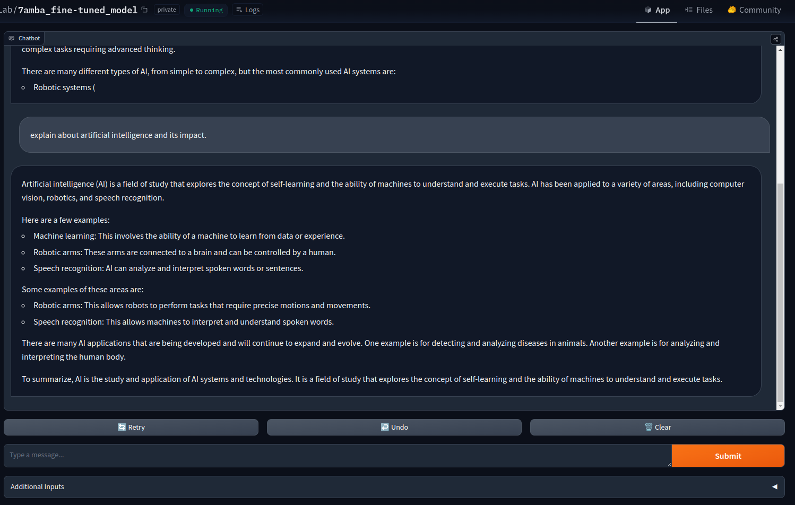
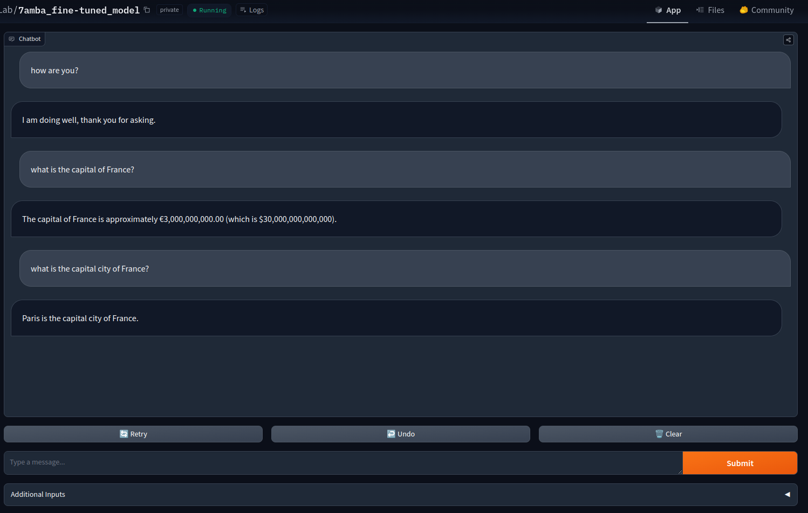

# 7amba
Welcome to the official repository for 7amba, a project developed as part of my final year college research. This project initially focused on exploring the innovative Mamba Architecture—a new SSM model architecture that shows competitive performance compared to the widely-adopted transformer model.

## Project Overview
Our research began with an investigation into the capabilities of the original Mamba Architecture. We aimed to explore the model capapbilities by integrating attention layers after every seven consecutive Mamba layers, hoping to enhance the model's performance further.

However, during our research, the original authors of Mamba released the Mamba-2 paper, which incorporated similar concepts to those we were exploring. Given this development, we decided to change our research focus. We shifted our project focus towards fine-tuning pretrained Mamba models on downstream chat tasks, due to the limited time for the final defense of the project.

## Current Focus: Fine-Tuning Mamba Models
This repository now contains code for finetuning mamba models on chat dataset. By making this code public, we hope to assist others who are working on fine-tuning pretrained Large Language Models (LLMs), particularly those based on the Mamba architecture.

Because we had difficulties intially when searching for ways to finetune the model. So, we hope this helps someone who is begining their LLM journey or exploring the finetuning domain.

We have also uploaded the code for hosting the model in huggingface space.

## Future Work: HAMBA
In parallel with this project, we are also working on a paper titled HAMBA, which further investigates the capabilities of the Mamba architecture. Once completed, we will release the associated code in the [repo](https://github.com/AssistantsLab/HAMBA).

## Getting Started
Simply clone the repo and get started with your finetuning. You have to adjust your dataset path.

## Sample outputs

Here are some of the outputs generated from the model.

This is the first image showing the output of the model.

This is the second image showing the output of the model.